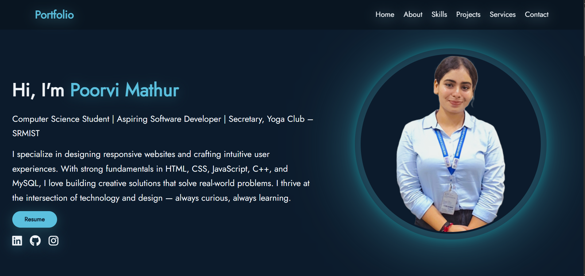

# 💻 Poorvi Mathur – Personal Portfolio Website

This is my fully responsive and animated portfolio website showcasing my background, skills, projects, and services as an aspiring software developer. Built using HTML, CSS, and JavaScript, the design reflects a modern dark-bluish theme with glowing visual effects and mobile-first layout.

## 🔥 Features

- Smooth scrolling navigation
- Responsive layout for all devices
- Animated glowing profile image
- Skills and projects with icons and hover effects
- Contact section with social links, details & illustration
- Stylish footer with copyright

## 📸 Preview



## 🌐 Live Preview

[View My Portfolio](https://poorvimathur22.github.io/Portfolio-Website/) <!-- Replace with actual URL -->

## 📁 Tech Stack

- HTML5
- CSS3 (Flexbox, Media Queries, Animations)
- JavaScript (Scroll handling, nav highlighting)

## 📂 Project Structure

```
portfolio-website/
│
├── assets/
│   └─ images/
├── index.html
├── style.css
└── script.js

```